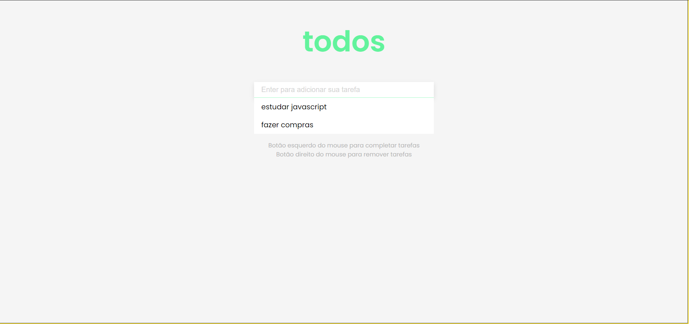

<h1 align="center">
    
</h1>

<h4 align="center"> 
	ToDo App 📝
</h4>

<p align="center">
  

  	
  
  <a href="https://github.com/Oppadayo/todo-app/commits/master">
    
  </a>

  
   <a href="https://github.com/Oppadayo/todo-app/stargazers">
    
  </a>
</p>


## 💻 Sobre o projeto

📚 Todo App - é uma aplicação simples para gerenciar melhor as taferas a serem feitas

O usuário pode:
- adicionar tarefas
- marcar tarefas como concluídas 
- deletar tarefas

## 🛠 Tecnologias

As seguintes ferramentas foram usadas na construção do projeto:

- [HTML]
- [CSS]
- [JavaScript]

### Pré-requisitos

Antes de começar, você vai precisar ter instalado em sua máquina as seguintes ferramentas:
- Um navegador
- Editor de texto (caso queira mexer no código)

## 🚀 Como executar o projeto

```bash
# Clone este repositório
$ git clone https://github.com/Oppadayo/todo-app

# Acesse a pasta do projeto no terminal/cmd
$ cd todo-app

# Execute a aplicação em modo de desenvolvimento
$ start chrome index.html
```


### 📝 ToDos
- [ ] Layout responsivo


